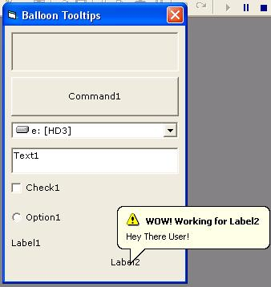



## ToolTip Balloon windowless \(no hwnd\)

### Description

This code set a balloon tool tip with the standard windows API on every type of control with or without window handle (no hwnd or windowless)

Please vote if you like it

Adapt this code for your needs
 
### More Info
 

             |
---                |---
**Submitted On**   |2005-04-27 10:39:14
**By**             |[Cydrix](https://github.com/Planet-Source-Code/PSCIndex/blob/master/ByAuthor/cydrix.md)
**Level**          |Beginner
**User Rating**    |5.0 (90 globes from 18 users)
**Compatibility**  |VB 4\.0 \(32\-bit\), VB 5\.0, VB 6\.0
**Category**       |[Custom Controls/ Forms/  Menus](https://github.com/Planet-Source-Code/PSCIndex/blob/master/ByCategory/custom-controls-forms-menus__1-4.md)
**World**          |[Visual Basic](https://github.com/Planet-Source-Code/PSCIndex/blob/master/ByWorld/visual-basic.md)
**Archive File**   |[ToolTip\_Ba1881494272005\.zip](https://github.com/Planet-Source-Code/cydrix-tooltip-balloon-windowless-no-hwnd__1-60232/archive/master.zip)

